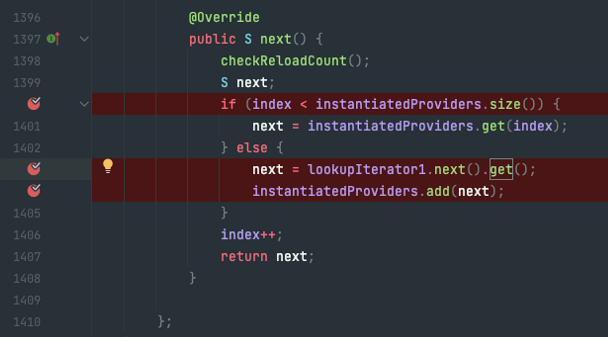
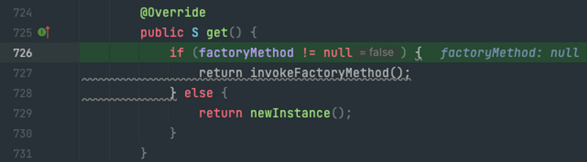
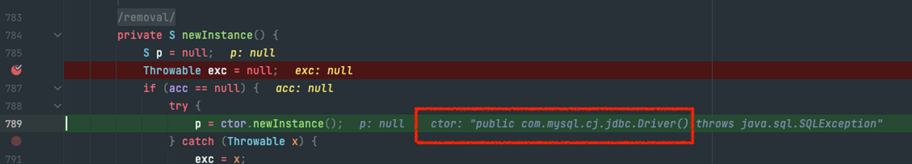

## 가장 중요한 것
### 분리와 확장을 고려한 설계 
- 관심사의 분리 

### 키워드 
- 예외 상황에 대한 처리 
- 리팩토링  

### 디자인 패턴 
- 소프트웨어 설계 시 특정 상황에서 자주 만나는 문제를 해결하기 위해 사용할 수 있는 재사용 가능한 솔루션 
- 각 패턴의 핵심이 담긴 목적 또는 의도가 중요함 
  - 적용할 상황, 해결해야 할 문제, 솔루션의 구조와 역할과 함께 핵심 의도가 무엇인지 기억할 것 

### 높은 응집도와 낮은 결합도
#### 응집도
- 응집도가 높다 == 하나의 모듈/클래스가 하나의 책임 또는 관심사에만 집중되어 있다.
- 응집도 : 모듈에 포함된 내부 요소들이 연관돼 있는 정도 
  - 모듈 내 요소들이 하나의 목적을 위해 긴밀하게 협력함 -> 높은 응집도 
  - 다른 목적을 추구함 -> 낮은 응집도 
- 변경 관점
  - 하나의 변경을 수용하기 위해, 변경이 일어난 요소를 포함한 모듈 전체가 함께 변경됨 -> 높은 응집도
    - 모듈의 일부만 변경됨 -> 낮은 응집도
  - 하나의 변경에 대해 하나의 모듈만 변경됨 -> 높은 응집도
    - 다수의 모듈이 함께 변경됨 -> 낮은 응집도
  - 서로 다른 이유로 변경되는 코드가 하나의 모듈 안에 공존함 -> 낮은 응집도

 

#### 결합도
- 의존성의 정도 
  - 다른 모듈에 대해 얼마나 많이 알고있는가에 대한 척도
  - 하나의 오브젝트가 변경이 일어날 때 관계를 맺고 있는 다른 오브젝트에게 변화를 요구하는 정도 
  - 결합도가 낮을 수록 변경 여파가 크지 않음 
- 느슨하게 연결된 형태를 유지하는 것이 바람직함 
  - 관계 유지 시 꼭 필요한 최소한의 방법만 간접적인 형태로 제공 
  - 나머지는 서로 알 필요도 없게 해줘야함 

## 중요한 것
### 자바 빈
- 두 가지 관례를 따라 만들어진 오브젝트 
  - 디폴트 생성자 : 리플렉션 때문에 필요 
  - 프로퍼티 : setXxx, getXxx -> 이걸로 필드를 조회함. 이름을 맞춰줘야 함

### 템플릿 메소드 패턴
- 기본적인 로직의 흐름을 만들고, 그 기능의 일부를 추상 메소드 등으로 만든 뒤 서브 클레스에서 이런 메소드를 필요에 맞게 구현해서 사용하도록 하는 방법
- 메소드를 각자 다르게 사용 

### 팩토리 메소드 패턴
- 서브클래스에서 구체적인 오브젝트 생성 방법을 결정하게 하는 것
- 오브젝트를 인터페이스로 리턴 -> 구체적인 구현체는 슈퍼클래스는 알지 못함 

### 클래스 사이의 관계 vs 오브젝트 사이의 관계 
- 클래스 사이의 관계 : 코드에 다른 클래스의 이름이 나타날 때 만들어짐 
- 오브젝트 사이의 관계 : 코드상에서는 특정 클래스를 알지 못하더라도, 클래스의 오브젝트를 인터페이스 타입으로 받아서 사용할 수 있음 (다형성)

### 개방 폐쇄 원칙(OCP)
- 변경엔 닫혀있고, 확장엔 열려있다

### 전략 패턴 
- OCP에도 잘 맞는 패턴 
- 자신의 기능 맥락(context)에서 필요에 따라 변경이 필요한 알고리즘을 인터페이스를 통해 통째로 외부로 분리시키고, 이를 구현한 구체적인 알고리즘 클래스를 필요에 따라 바꿔서 사용할 수 있게 하는 디자인패턴 
- 클라이언트는 컨텍스트가 사용할 전략을 생성자 등을 통해 제공해준다.

## 궁금한 것
static 블록 초기화가 되려면 Driver 구현체를 호출해야 한다는 얘기니까, 대체 어디서 호출해주나 궁금했는데 DriverManager의 ensureDriversInitialized() 메서드가 수행되면서 Driver의 static 블록이 수행되네욤

DriverManager -> ServiceLoader 호출 (Driver.class 넘김) -> ServiceLoader 생성 (초기화 될 때 Driver의 인터페이스 정보가 등록됨) -> 어떠한 이유로 Iterator에서 공급자(Driver 구현체)의 인스턴스를 반환함 <——— 이 때 초기화가 되네요

Iterator를 돌면서 `next().get()`을 호출

`newInstance()` 호출

`ctor` : Driver의 constructor → 리플렉션을 통해 생성 → p에는 Driver 구현체가 들어서게됨. (이 때 Driver 클래스 초기화)
