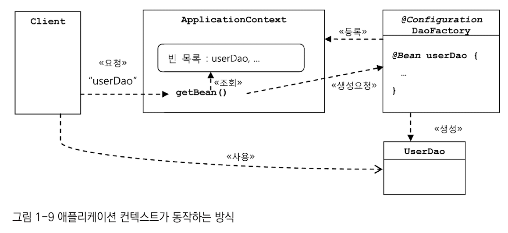

## 가장 중요한 것 
### 애플리케이션 컨텍스트의 동작 방식

## 중요한 것
### 빈 
- 스프링 컨테이너가 생성과 관계 설정, 사용 등을 제어해주는 제어의 역전이 적용된 오브젝트 

### 빈 팩토리
- 빈의 생성과 관계 설정 같은 제어를 담당하는 IoC 오브젝트

### ApplicationContext
- 빈 생성, 관계 설정 등의 제어 작업 총괄 

### @Configuration & @Bean
- @Bean이 붙어있는 메소드의 이름이 빈 이름이 됨 

### 설정 정보/설정 메타 정보 
- 애플리케이션 컨텍스트, 빈 팩토리가 IoC를 적용하기 위해 사용하는 메타정보 
- IoC 컨테이너에 의해 관리되는 애플리케이션 오브젝트를 생성하고 구성할 때 사용됨 

### IoC 컨테이너
- 애플리케이션 컨텍스트 
  - ApplicationContext를 구현한 오브젝트
  - 하나의 애플리케이션 내에서 보통 여러개가 만들어져 사용 됨 
  - 이를 통틀어 스프링 컨테이너라고 부름 

## 궁금한 것 

