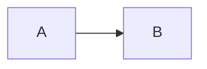

## 가장 중요한 것
### 의존관계 주입
- 클래스모델, 코드에서는 런타임 시점의 의존 관계가 드러나지 않음. (인터페이스에 의존하고 있어야 함)
- 런타임 시점의 의존 관계는 컨테이너나 팩토리 같은 제 3의 존재가 결정함 
- 의존 관계는 사용할 오브젝트에 대한 레퍼런스를 외부에서 제공(주입) 해줌으로써 만들어짐 
- 주입은 다이나믹하게 구현 클래스를 결정해서 제공받을 수 있도록 인터페이스 타입의 파라미터를 통해 이뤄져야 함 

## 중요한 것
### 의존한다 

- A가 B에 의존하고 있음 
  - B는 A에 의존하고 있지 않음. (영향을 받지 않음)
- 변경이 의존 대상에게로 영향을 미친다.
  - 즉, B가 변경되면 A에 영향을 미친다.

### 의존관계 검색
- 컨테이너에 담긴 오브젝트를 사용하려면 적어도 한 번은 의존관계 검색 방식을 사용해 오브젝트를 가져와야 함 

## 궁금한 것 