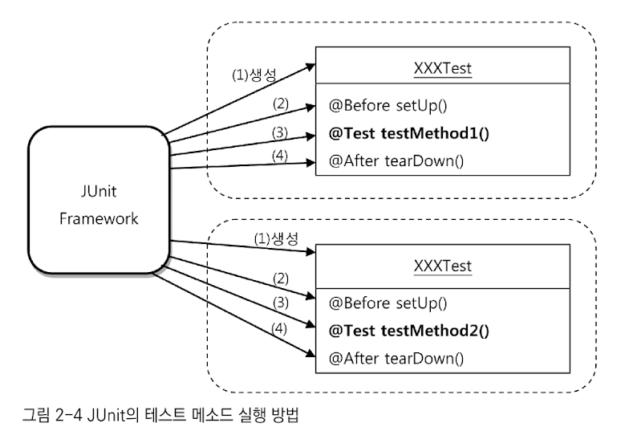

# 2장
## 가장 중요한 것
### JUnit 프레임워크가 테스트 메소드를 실행하는 과정 (책은 JUnit4, 지금은 JUnit5)

1. 테스트 클래스에서 `@Test`가 붙은 메서드를 찾는다. 
2. 테스트 클래스의 오브젝트를 하나 만든다.
3. `@BeforeEach`가 붙은 메소드가 있으면 실행한다.
4. `@Test`가 붙은 메소드를 하나 호출하고 결과를 저장해둔다.
5. `@AfterEach`가 붙은 메소득 ㅏ있으면 실행한다.
6. 나머지 테스트 메소드에 대해 2~5번을 반복한다.
7. 모든 테스트 결과를 종합해서 돌려준다. 

### JUnit 특징 
- 테스트 메소드를 실행할 때 마다, 테스트 클래스의 오브젝트를 만든다.
- 한 번 만들어진 테스트 클래스의 오브젝트는 하나의 테스트 메소드를 사용하고 나면 버려진다.
  - 이는 각 테스트가 서로 영향을 주지 않고 독립적으로 실행됨을 확실히 보장해주기 위함이다.
  - 덕분에 인스턴스 변수도 부담 없이 사용 가능 

### 픽스처 
- 테스트를 수행하는 데 필요한 정보나 오브젝트 
- `@BeforeEach`를 이용해 생성해두면 편리함 

### 동등 분할(equivalence partitioning)
- 같은 결과를 내는 값의 범위를 구분해서 각 대표 값으로 테스트를 하는 방법 
- 어떤 작업의 결과가 true, false, 예외 발생 세 가지라면
  - 각 결과를 내는 입력 값이나 상황의 조합을 만들어 모든 경우에 대한 테스트를 해보는 것이 좋다.

### 경계값 분석(boundary value analysis)
- 에러는 동등분할 범위의 경계에서 주로 많이 발생하는 특징이 있음 
- 그 경계 근처에 있는 값을 이용해 테스트하는 방법
- 보통 숫자의 입력 값인 경우, 0이나 그 주변값 또는 정수의 최대값, 최소값 등으로 테스트해보면 도움이 될 때가 많음

## 중요한 것
[다른 테스트 프레임워크, Mokito](https://www.oreilly.com/library/view/mockito-essentials/9781783983605/ch02s03.html)
- 내부적으로 CGLib을 사용하여 프록시를 만든다고 함. (프록시 디자인 패턴 적용) + 리플렉션 

### 픽스처 생성에 시간과 자원이 많이 소모되는 경우 
- ex: applicationContext
- 테스트는 독립적으로 매번 새로운 오브젝트를 만드는 것이 원칙이나, 비용 문제로 테스트 전체가 공유하는 오브젝트를 만들기도 함 
- ApplicationContext는 초기화되고 나면 내부 상태가 바뀌는 일의 거의 없음
  - 테스트 일관성이 보장될 것임 
  - 실행 순서가 결과에 영향을 미치지 않을 것임 
- `@BeforeTestClass`
  - 해당 스태틱 메소드에서 애플리케이션 컨텍스트를 만들어 스태틱 변수에 저장해두고 사용 가능 
- 혹은 `@SpringBootTest` 이용 

### 애플리케이션 컨텍스트 
- 초기화할 때 자기 자신도 빈으로 등록함

### `@Autowired`
- 같은 타입의 빈이 두 개 이상 있는 경우, 타입만으로는 어떤 빈을 가져올지 결정할 수 없음 
- 타입으로 빈을 선택할 수 없는 경우 -> 변수의 이름과 같은 빈이 있는지 확인 -> 변수 이름으로도 확인할 수 없다면 예외 발생 

### 학습 테스트 
- 무언가를 새로 배울 때 테스트를 기반으로 배우는 것 

### 버그 테스트 
- 기능 오류가 발견됐을 경우, 무턱대고 코드를 수정하기 보다 먼저 버그 테스트를 만들어라.
- 버그가 원인이 돼서 실패하는 코드를 만든다 -> 버그 테스트가 성공할 수 있도록 애플리케이션 코드를 수정한다. -> 성공 시 버그 해결!
- 장점과 필요성
  - 테스트의 완성도를 높여줌 (버그가 발생한 이유는 기존 테스트가 미처 검증하지 못했기 때문) 
  - 버그의 내용을 명확하게 분석하게 해줌 
    - 예외적인 상황이나 입력 값 때문에 발생하는 오류였다면, 테스트 코드를 만들면서 오류를 발생시키는 값의 범위가 어떤 것인지 분석해볼 기회가 주어짐 
    - 동등 분할, 경계값 분석을 적용해볼 수도 있음 
  - 기술적인 문제를 해결하는 데 도움이 됨 
    - 동일한 문제가 발생하는 가장 단순한 코드와 그에 대한 버그 테스트를 만들어보면 도움이 됨 

## 궁금한 것 