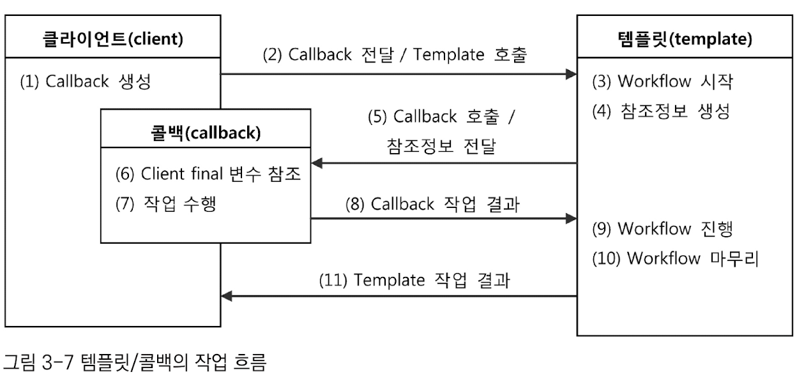
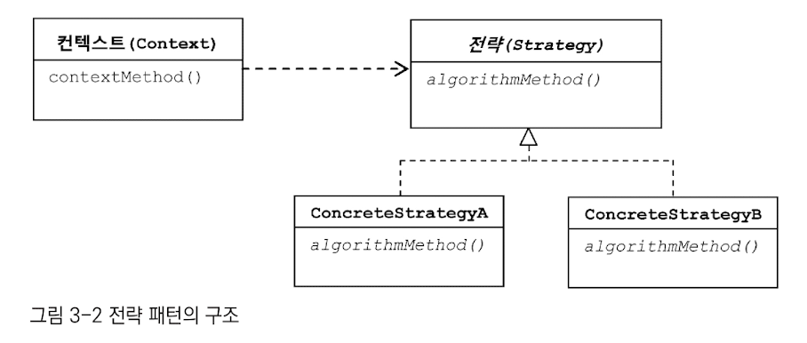
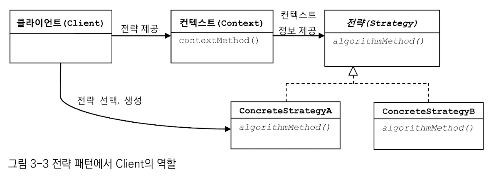

# 템플릿
## 가장 중요한 것
### 템플릿/콜백 패턴 

- 전략 패턴의 기본 구조 + 익명 내부클래스 활용  
- 템플릿 : 전략 패턴의 컨텍스트
  - 어떤 목적을 위해 미리 만들어둔 틀
- 콜백 : 익명 내부 클래스로 만들어지는 오브젝트
  - 실행되는 것을 목적으로 다른 오브젝트의 메소드에 전달되는 오브젝트 
  - 파라미터로 전달되지만, 값을 참조하기 위한 것이 아니라, 특정 로직을 담은 메소드를 실행시키기 위해 사용함 
  - 자바 8부터는 **람다 표현식**과 **함수형 인터페이스**를 제공한다. 이를 사용하여 메소드 자체를 파라미터로 넘길 수 있다.

#### 특징 
- 단일 메소드 인터페이스 사용 (자바 8부터는 함수형 인터페이스)

### 템플릿과 콜백을 찾아내는 방법 
- 변하는 코드의 경계를 찾는다 
- 경계를 사이에 두고 주고받는 일정한 정보가 있는지 확인한다. 
- 인터페이스로 만든다. 

## 중요한 것
### 전략 패턴 

- 확장에 해당하는 부분을 별도의 클래스로 만들어, 추상화된 인터페이스를 통해 위임하는 방식 
  - contextMethod() : 변하지 않는 부분
- 변하지 않는 일정한 패턴을 갖는 작업 흐름 + 일부분만 자주 바꿔서 사용해야 하는 경우 적합 

### 전략 패턴에서의 Client 역할 

- DI란, 전략 패턴의 장점을 일반적으로 활용할 수 있도록 만든 구조다

### 긴밀한 관계를 갖는 클래스 
- 어색하게 따로 빈으로 분리하지 않고, 내부에서 직접 만들어 사용하도록 구성해도 됨 
- 사용하는 클래스 측에서 사용 당하는 클래스를 생성하고 DI까지 해줌 
- 관계를 외부에 드러내지 않을 수 있음 

## 궁금한 것 