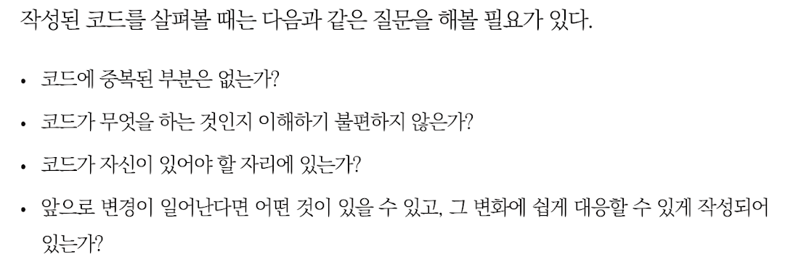
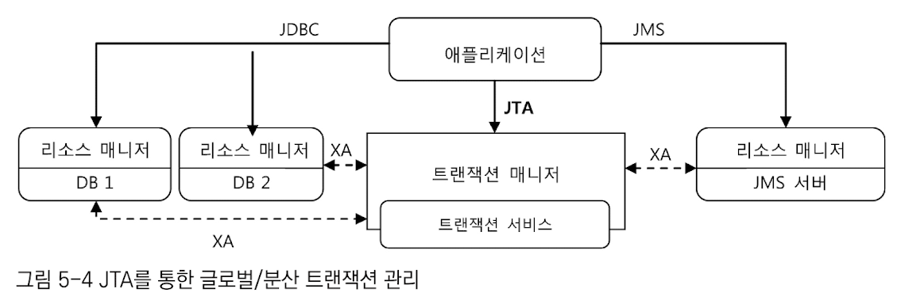
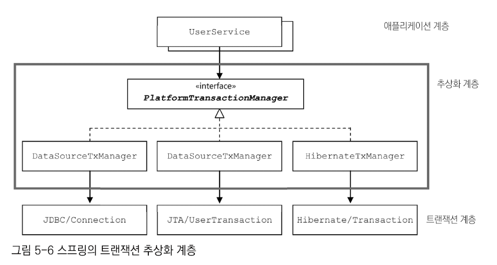
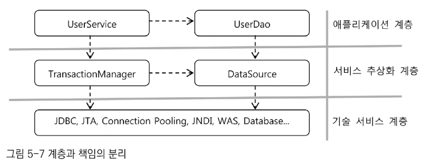
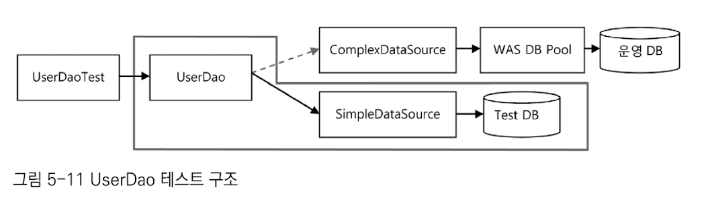
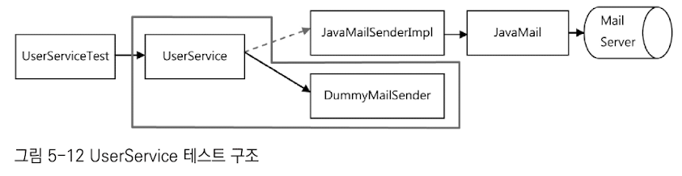
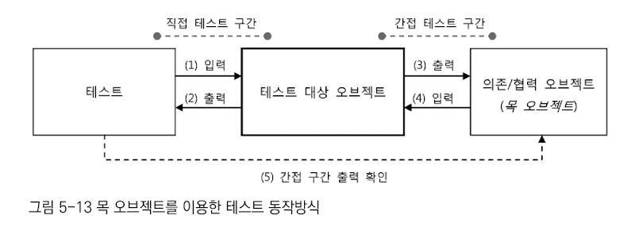
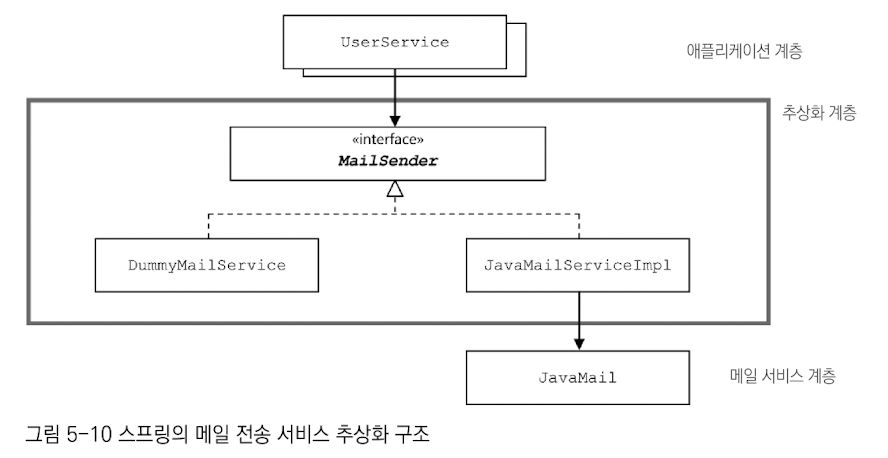

# 템플릿

## 가장 중요한 것


### 트랜잭션의 경계 설정
- 트랜잭션이 시작되고 끝나는 위치
  - 해당 위치 설정 작업은 매우 중요하다.
- 트랜잭션의 시작과 종료는 Connection을 통해 이뤄진다. 
  - autoCommit = false로 설정해주면 트랜잭션 시작 
- 하나의 DB 커넥션 안에서 만들어지는 트랜잭션 -> 로컬 트랜잭션 

### 하나 이상의 DB가 참여하는 트랜잭션을 만들기 위해서는 JTA를 이용해야 한다


### 스프링의 트랜잭션 추상화 

- PlatformTransactionManager <- AbstractPlatformTransactionManager
- 위 코드를 보면 놀라울 정도로 추상화를 잘 해놨다. 공통 부분을 뽑아내서 추상화하는 것은 이렇게 하는거구나.. 
- 변경에 유연한 코드를 얻는 것은 정말 쉽지만은 않은 작업인 것 같다. 

그 결과, 아래와 같이 계층과 책임을 분리할 수 있게 됨

- 스프링의 DI가 아주 중요한 역할을 함 
  - 관심, 책임, 성격이 다른 코드를 깔끔하게 분리해준다.

### 스프링의 DI는 스프링 기술의 기반이 되는 핵심 엔진이자 원리이다.

### 테스트 구조




## 중요한 것
```java
TransactionSynchronizationManager.initSynchronization();  // 트랜잭션 동기화 매니저
DataSourceUtils.getConnection(dataSource);
```

### 스프링의 빈으로 등록할 때 고려할 것 
- 싱글톤으로 사용해도 되는가
  - 여러 스레드에서 동시에 사용해도 괜찮은가 
  - 멀티스레드 환경에서 안전하지 않은 클래스를 빈으로 무작정 등록하거나, 상태를 갖고 있으면 심각한 문제가 발생한다.
- PlatformTransactionManager의 구현 클래스들은 싱글톤으로 사용이 가능 -> 빈 등록 ok


### 용어
- 테스트 대역 : 테스트 대상이 되는 오브젝트의 기능에만 충실하게 수행하면서 빠르게, 더 자주 테스트를 실행할 수 있도록 사용하는 오브젝트 
- 테스트 스텁 : 대표적인 테스트 대역 
  - 테스트 대상 오브젝트의 의존 객체로서 존재 
  - 테스트 동안에 코드가 정상적으로 수행할 수 있도록 돕는 것을 의미 
- 목 오브젝트(mock object)
  - 
  - 테스트 오브젝트가 정상적으로 실행되도록 도와줌 
  - 테스트 오브젝트와 자신의 사이에서 일어나는 커뮤니케이션 내용을 저장해뒀다가 테스트 결과를 검증하는 데 활용할 수 있게 해줌 


### JavaMail 처럼 테스트를 어렵게 만드는 건전하지 않은 방식으로 설계된 API는 아래와 같이 사용하자. 

- 스프링은 MailSender라는 인터페이스를 제공 해줌으로써, 애플리케이션 계층과 서비스 추상화 계층을 분리했다.
- 외부의 리소스와 연동하는 대부분의 작업은 추상화의 대상이 될 수 있다.  


## 궁금한 것 
### 쓰레드 로컬이 어떻게 동작하는지 알아보자 