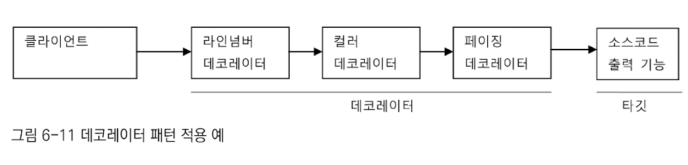
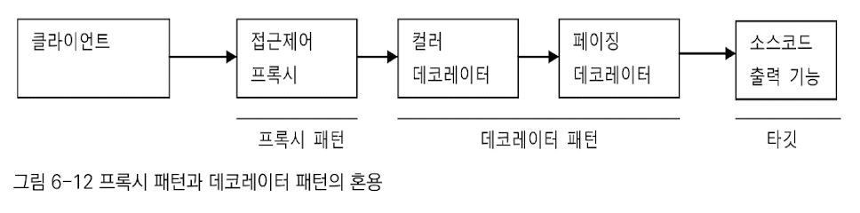
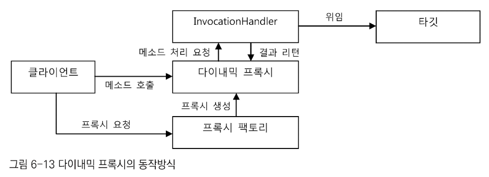
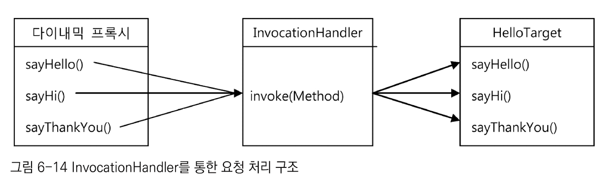
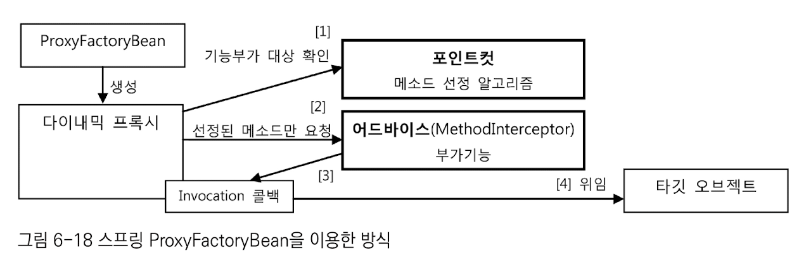
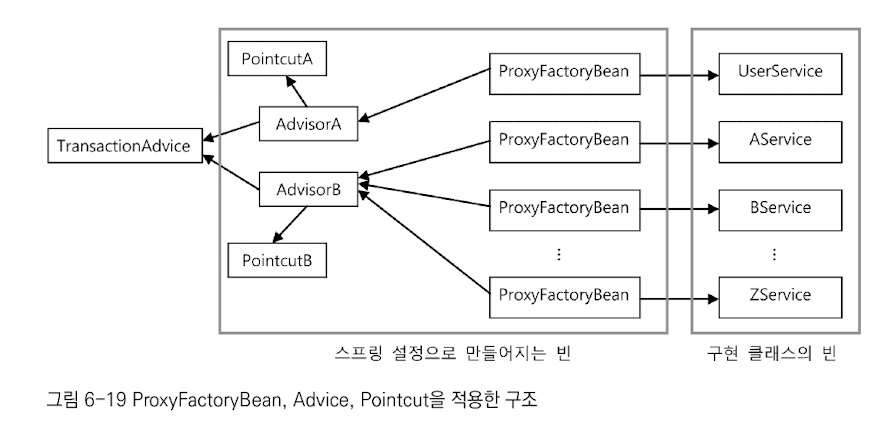
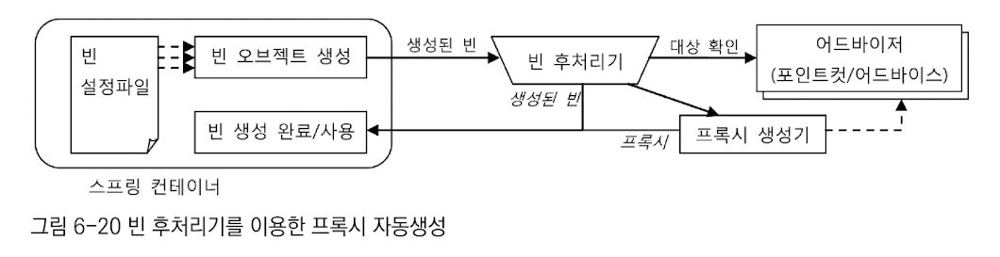
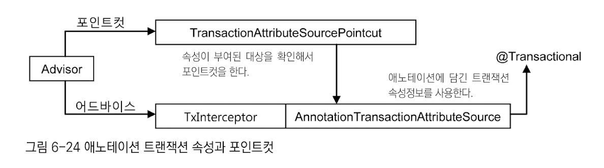

# AOP 
## 가장 중요한 것
### 단위 테스트와 통합 테스트 
- 단위 테스트 : 테스트 대상 클래스를 목 오브젝트 등의 테스트 대역을 이용해 의존 오브젝트나 외부의 리소스를 사용하지 않도록 고립시켜서 테스트하는 것 
- 통합 테스트 : 두 개 이상의 성격이나 계층이 다른 오브젝트가 연동하도록 만들어 테스트하거나, 또는 외부의 DB나 파일, 서비스 등의 리소스가 참여하는 테스트 
  - 두 개 이상의 단위가 결합해서 동작하며 테스트가 수행되는 것 
  - `@SpringBootTest`를 이용하는 것도 통합테스트에 속함 


### 단위 vs 통합 가이드라인 
- 항상 단위 테스트를 우선적으로 고려할 것 
- 하나의 클래스나 성격과 목적이 같은 긴밀한 클래스 몇 개를 모은다.
  - 외부와의 의존관계를 모두 차단한다.
  - 필요에 따라 스텁이나 목 오브젝트 등의 테스트 대역을 이용하도록 만든다.
- 외부 리소스를 사용해야만 가능한 테스트는 통합 테스트로 만든다. 
- 단위 테스트로 만들기 어려운 코드
  - DAO(Repository) : DB를 통해 로직 수행 
- 여러 단위가 의존관계를 가지고 동작할 때를 위한 통합 테스트는 필요하다.
  - 단위 테스트를 충분히 거친 경우, 통합 테스트의 부담은 상대적으로 감소한다.
- 단위 테스트를 만들기가 너무 복잡하다고 판단되는 코드는 처음부터 통합 테스트를 고려한다.
  - 통합 테스트에 참여하는 코드 중에서 가능한 한 많은 부분을 미리 단위테스트로 검증한다.
- `@SpringBootTest`도 통합테스트다.
  - 가능하면 스프링의 지원 없이 직접 코드 레벨의 DI를 사용 해가면서 단위테스트를 하는 것이 좋다. 
  - 필요할 때만 이용하자. 

### 데코레이터 패턴

- 타깃에 부가적인 기능을 런타임 시 다이내믹하게 부여해주기 위해 프록시를 사용하는 패턴을 의미 
- 다이내믹하게 기능을 부가한다 == 컴파일 시점에서는 어떤 방법과 순서로 프록시와 타깃이 연결되어 사용되는지 정해져 있지 않음 
- 프록시가 꼭 한개로 제한되지 않음 
  - 여러개일 경우 순서를 정해서 단계적으로 위임
- 대표적인 예시 : InputStream, OutputStream 구현 클래스 
- 인터페이스를 통해 위임 -> 어느 데코레이터에서 어느 타깃으로 연결될 지 컴파일 타임에는 알 수 없음 


### 프록시 패턴 

- 프록시 : 클라이언트와 사용 대상 사이에 대리 역할을 맡은 오브젝트를 두는 방법 
- 프록시 패턴 : 프록시를 사용하는 방법 중에서 타깃에 대한 접근 방법을 제어하려는 목적을 가진 경우 
  - 사용 시점에 실제 오브젝트를 만들고 프록시는 레퍼런스만제공
  - 타깃에 대한 접근 권한을 제어할 때도 사용 가능 
    - `UnmodifiableList`가 대표적인 권한 제어 프록시이다.
- 데코레이터 패턴은 자신이 위임할 대상이 누군지 모름
- 프록시 패턴은 타깃 클래스 정보를 알고 있는 경우가 많음 
- 기존 코드에 영향을 주지 않으면서 타깃의 기능을 확장하거나 접근 방법을 제어할 수 있는 유용한 패턴 


### 다이나믹 프록시 

- 다이나믹 프록시 오브젝트는 클라이언트의 모든 요청을 리플렉션 정보로 변환해서 invocationHandler 구현 오브젝트의 invoke() 메서드로 넘긴다.
  - 타깃 인터페이스의 모든 메소드 요청이 하나의 메소드로 집중됨

  

- 다이나믹 프록시가 받는 요청 -> invoke() 메소드로 보냄

### 프록시 팩토리 빈

- MethodInterceptor의 invoke() 메서드는 ProxyFactoryBean으로 부터 타깃 오브젝트에 대한 정보까지도 함께 제공받음 -> 굳이 타깃 오브젝트를 DI 받을 필요가 없음 
  - 타깃 오브젝트에 상관없이 독립적으로 만들어질 수 있음 
- Advice
  - 타깃 오브젝트에 적용하는 부가 기능을 담은 오브젝트
    - 타깃이 필요 없는 순수한 부가 기능
    - MethodInterceptor는 Advice 타입이다. 
  - MethodInterceptor에는 메서드 정보와 함께 타깃 오브젝트가 담긴 MethodInvocation 오브젝트가 전달 됨
  - MethodInvocation은 타깃 오브젝트의 메서드를 실행할 수 있는 기능이 있음 


### Advisor

- Pointcut과 Advice를 따로 등록하면 어떤 어드바이스에 대해 어떤 포인트컷을 적용할지 애매해지기 때문에, Advisor로 한데 묶어서 세팅해야 한다. 

### 빈 후처리기



### 프록시 방식 AOP는 같은 타깃 오브젝트 내의 메소드를 호출할 때는 적용되지 않음!
```text
Transaction을 적용하기 위한 proxy라고 가정 해보자. 

                 +-----+     +-----+
                 | a() |     | a() | 
client   -->     | b() |     | b() | 
                 +-----+     +-----+
                  proxy       target
 
[ Transaction이 적용되는 경우 ]
- 클라이언트가 proxy를 통해 target의 메서드를 호출할 때 
- 클라이언트가 proxy.a()를 호출하고, 해당 메서드가 내부에서 proxy.b()를 호출할 때 

[ Transaction이 적용되지 않는 경우 ]
- 클라이언트가 target의 메서드를 직접 호출할 때 

- target.a()가 직접 호출되었고, target이 내부적으로 target.a()가 target.b()를 호출하도록 구성했을 때 

- proxy를 통해 target.a()가 호출되어 a()에는 트랜잭션이 적용되었다고 가정
  - target.a()가 target.b()를 호출하면, b()에 다른 트랜잭션 옵션이 적용되어 있어도 무시하고 그저 a()의 트랜잭션에 참여만 함
  
- a()는 트랜잭션이 적용되지 않은 메서드, b()는 트랜잭션이 필요한 메서드라고 가정 
  - target.a()가 target.b()를 호출하면, 아무리 b()가 트랜잭션이 필요해도 트랜잭션이 적용되지 않는다.
```

### @Transactional

- 4단계의 대체(fallback) 정책
- 메서드 속성 확인 순서 
  - 타깃 메서드 -> 타깃 클래스 -> 선언 메서드 -> 선언 타입(클래스, 인터페이스) 순서로 `@Transactional` 적용 여부 확인 
    - 선언 메서드, 선언 타입은 부모 클래스/인터페이스를 의미 
  - 가장 먼저 확인되는 속성 정보 사용 | 발견되지 않는 경우에는 트랜잭션 미적용 

### 트랜잭션 추상화
#### 핵심 : 트랜잭션 매니저와 트랜잭션 동기화 
- 트랜잭션 매니저
  - `PlatformTransactionManager` 인터페이스를 구현한 트랜잭션 매니저를 통해 구체적인 트랜잭션 기술 종류에 상관 없이 일관된 트랜잭션 제어 가능


- 트랜잭션 동기화 
  - 트랜잭션 동기화 기술을 통해 시작된 트랜잭션 정보(커넥션)를 저장소에 보관해뒀다가 DAO에서 공유 가능
  - 트랜잭션 전파에도 중요한 역할 수행 
  - 진행 중인 트랜잭션이 있는지 확인 -> 트랜잭션 전파 속성에 따라 이에 참여할 수 있도록 만들어줌 

---

## 중요한 것

### 테스트가 쉬운 코드 == 깔끔하고 좋은 코드인 경우가 많다

### 팩토리 빈
- 스프링은 내부적으로 리플렉션 API를 이용해서 빈 정의에 나오는 클래스 이름을 가지고 빈 오브젝트를 생성함
- 디폴트 생성자로 만드는 방법 이외에도 여러가지 방법이 있는데, 그 중 하나가 FactoryBean임 
- 스프링을 대신해서 오브젝트의 생성 로직을 담당하도록 만들어진 특별한 빈 
- 팩토리 메서드를 가진 오브젝트 
- 해당 인터페이스를 구현한 클래스가 빈의 클래스로 지정될 경우, 팩토리 빈 클래스의 오브젝트의 getObject() 메서드를 통해 오브젝트를 가져오고, 이를 빈 오브젝트로 사용함 
  - 결론적으로, getObject() 메서드가 생성해주는 오브젝트가 실제 빈의 오브젝트로 대치됨 


- 다이나믹 프록시 오브젝트는 일반적인 방법으로는 스프링의 빈으로 등록할 수 없음 
  - 팩토리 빈을 사용하면 다이나믹 프록시 오브젝트를 스프링의 빈으로 만들어줄 수 있음 
  - SpringBoot에서는 `@Configuration`, `@Bean` 조합으로 직접 등록해줘도 됨 (영한쌤 강의 참고)  


### `DefaultTransactionDefinition`
트랜잭션 동작방식에 영향을 줄 수 있는 네 가지 속성을 정의함 
- 트랜잭션 전파
  - propagation_required (default)
    - 메서드 구성에 따라 다르게 구성 됨. 
    - A의 내부에서 B가 수행된다면 B는 A의 트랜잭션에 참여함. A와 B가 따로 수행된다면 따로 트랜잭션이 구성됨.
  - propagation_requires_new
    - 어떤 상황이든 간에 항상 새로운 트랜잭션 시작 
  - propagation_not_supported
    - 트랜잭션 없이 동작하도록 만들 수도 있음 
    - 한 클래스 내의 100개의 메서드가 트랜잭션에 참여하는데, 1개의 메서드만 트랜잭션을 사용하고 싶지 않을 때 사용하는 옵션 
  - `TransactionManager`의 `getTransaction()`메서드는 항상 트랜잭션을 새로 생성하는 것이 아님 
    - 트랜잭션의 속성과 현재 진행 중인 트랜잭션 존재 여부에 따라 새로 시작할 수도 있고, 이미 진행 중인 트랜잭션에 참여할 수도 있음 
- 격리 수준
  - isolation_default 
    - DataSource에 설정되어 있는 디폴트 격리 수준을 그대로 따른다는 뜻 
- 제한 시간 
  - 제한 시간이 없는 것이 default
  - propagation_required, propagation_requires_new 옵션과 함께 사용해야 유의미함 
- 읽기 전용(Read-only)
  - 트랜잭션 내에서 데이터를 조작하는 시도를 막아줌 
  - 데이터 액세스 기술에 따라 성능이 향상될 수도 있음 


### 트랜잭션 구분 
- 선언적 트랜잭션 
  - AOP를 이용해 코드 외부에서 트랜잭션의 기능을 부여해주고 속성을 지정할 수 있게 하는 방법 
- 프로그램에 의한 트랜잭션 
  - TransactionTemplate나 개별 데이터 기술의 트랜잭션 API를 이용해 직접 코드 안에서 사용하는 방법 

## 궁금한 것 
